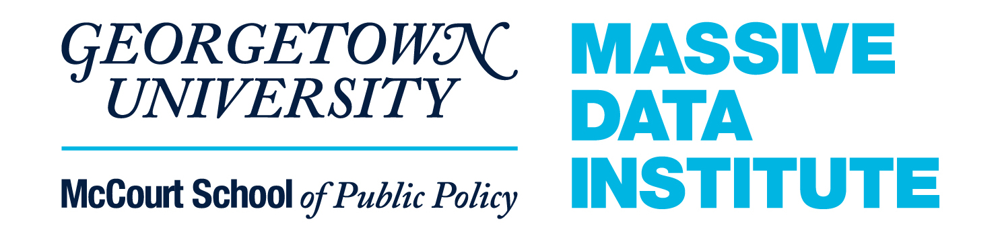
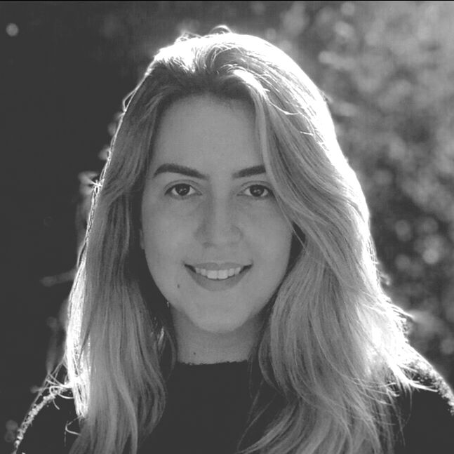

```{r setup, include=FALSE}
knitr::opts_chunk$set(echo = FALSE)
```


## You are invited

<center>

<span style="margin:5%">
  
</span>

*MDI and the ASA Record Linkage Interest Group's Linkage Seminar Series: *

<big>**Hausdorff Distance: A Powerful Tool to Match Households in Record Linkage**</big>

Thursday, February 24, 2022

1 - 2 PM ET

<big>
[**Register Here**](https://georgetown.zoom.us/meeting/register/tJUodeuqrj0uGdy7AaYhys-w2mQ9nJ_07A4H)
</big>

Zoom Webinar

</center>


For February’s Linkage Seminar, Amy O’Hara will be joined by Thais Menezes, a PhD student at SFI Centre for Research Training in Foundations of Data Science, University College Dublin. Thais’ work incorporates the household structure in recording linkage matching in the Ireland census database to make the process of matching individuals easier and more accurate.

This seminar will be recorded and resources will be [posted online](https://mccourt.georgetown.edu/research/the-massive-data-institute/resources/linkage-project-seminars/) after the event.


## Guest Speaker: *Thais Menezes*

<center>
 
</center>

### **Thais Menezes** 
Thais Menezes is a Ph.D. student of the SFI Centre for Research Training in Foundations of Data Science (https://www.data-science.ie/) program. She is based in Ireland and her university is the University College Dublin (UCD). Currently, her thesis is regarding Record Linkage and she works with Dt Michael Fop and Professor Brendan Murph - both also from UCD. She is from Brazil and had a bachelor's and a master's degree in statistics. She has some previous work in the Survival Analysis field in which she adapted a Current Status Data model to incorporate Misclassification. During her master's, she worked with the Singular Decomposition Value theorem to find latent maps for cancers databases from different countries. She also has experience working as a statistician at a bank and at a marketing company. She loves to work developing models and methodologies that require a strong computational base and she loves to code using R and Python.


### About the Linkage Seminar Series

The Massive Data Institute at Georgetown University's McCourt School of Public Policy co-hosts monthly Linkage Seminars with the American Statistical Association's Record Linkage Interest Group. These monthly seminars feature interdisciplinary data experts discussing their work on data linkages across data types, sectors, domains, and disciplines.


