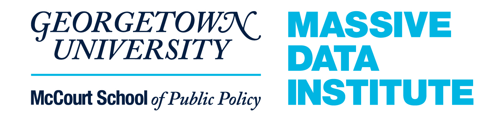
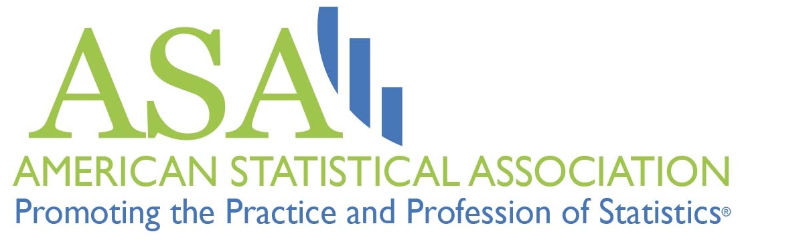

```{r setup, include=FALSE}
knitr::opts_chunk$set(echo = FALSE)
```


## You are invited

<center>

<span style="margin:5%">
  
</span>

*MDI and the ASA Record Linkage Interest Group's Linkage Seminar Series: *

<big>**Bayesian Procedures for File Linking with Application to Health Services Research
**</big>

Friday, April 1, 2022

2 PM ET

<big>
[**Register Here**](https://georgetown.zoom.us/meeting/register/tJYrcuirrTwvGtK0MY9HuIWpafgZmqnJfDOs)
</big>

Zoom Webinar

</center>


 Roee Gutman will present work that view record linkage as a missing data problem and he will describe Bayesian procedures that utilize data features that are frequently encountered in public health applications. These procedures improve the linkage, and result in more accurate and precise estimates of scientifically important associations. The first procedure incorporates associations between variables exclusive to one of the datasets in the linkage process. The second procedure ensures that individuals receiving care from the same provider in one file are linked to individuals receiving care from a similar provider in the other file. Roee will demonstrate these procedures using two applications: one combines Medicare claims records and Vital Statistics Mortality records to study the association between end-of-life medical expenses and causes of death. A second application combines records from the National Trauma Databank with Medicare claims data to study the relationship between injury characteristics and successful discharge to the community among patients with traumatic brain injury.

This seminar will be recorded and resources will be [posted online](https://mccourt.georgetown.edu/research/the-massive-data-institute/resources/linkage-project-seminars/) after the event. 

## Guest Speaker: *Roee Gutman*

<center>
 
</center>

### **Roee Gutman** 

Roee Gutman is an Associate Professor in the Department of Biostatistics at Brown University. His areas of expertise are causal inference, file linkage, missing data, Bayesian analysis and their application to health services research. He has been the lead statistician on multiple NIH and VA grants, and he has received two PCORI methods award. Roee has developed multiple procedures to link and analyze healthcare data.


### About the Linkage Seminar Series

About the Linkage Seminar Series: The Massive Data Institute at Georgetown University's McCourt School of Public Policy co-hosts monthly Linkage Seminars with the American Statistical Association's Record Linkage Interest Group. These monthly seminars feature interdisciplinary data experts discussing their work on data linkages across data types, sectors, domains, and disciplines. 


