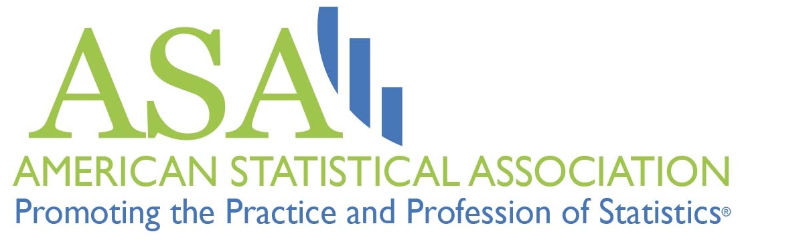

```{r setup, include=FALSE}
knitr::opts_chunk$set(echo = FALSE)
```


## You are invited

<center>

<span style="margin:5%">
  
</span>

*MDI and the ASA Record Linkage Interest Group's Linkage Seminar Series: *

<big>**AI and duplicate detection to leverage external data sources
**</big>

Thursday, April 21, 2022

1 PM ET

<big>
[**Register Here**](https://georgetown.us4.list-manage.com/track/click?u=75735457ea2e5c2e9b812d874&id=c99a91292d&e=fd53731255)
</big>

Zoom Webinar

</center>


**David Beauchemin** will discuss how duplicate detection can be used with AI and NLP techniques to extract information from external data sources using text distance metrics (e.g. Jaro) and classification algorithms. He will use a case study in insurance to demonstrate the proposed approach.

This seminar will be recorded and resources will be [posted online](https://georgetown.us4.list-manage.com/track/click?u=75735457ea2e5c2e9b812d874&id=4bbddf38f4&e=fd53731255) after the event. 

## Guest Speaker: *David Beauchemin*

<center>
 
</center>

### **David Beauchemin** 

An actuary by training, David decided to continue his studies at the master's level in computer science to become familiar with machine learning. His master's degree in natural language processing (NLP) focused on external source extraction in an insurance business process. He is now pursuing his studies at the Ph.D. level, where he is interested in personalizing automatically generated content from insurance contracts. 

### About the Linkage Seminar Series

The Massive Data Institute at Georgetown University's McCourt School of Public Policy co-hosts monthly Linkage Seminars with the American Statistical Association's Record Linkage Interest Group. These monthly seminars feature interdisciplinary data experts discussing their work on data linkages across data types, sectors, domains, and disciplines. 


